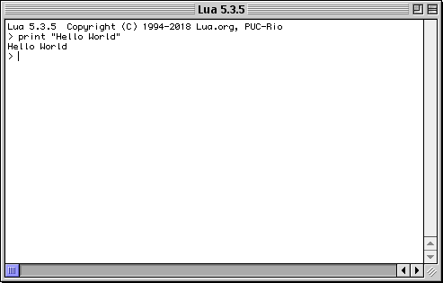
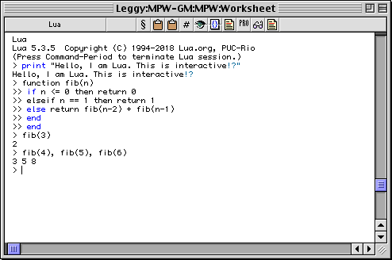
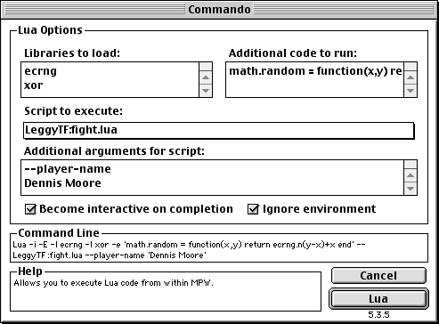

What is this?
=============

This is a "proper" port of Lua 5.3 to the greatest,but classic operating system in the world: Classic MacOS!

Requirements
============

- 68020 or better
- At least 1MB of memory
- System 7.1.2 or later
- CFM-68K Runtime Enabler (not required on PowerPC)

Lua Engine
==========

Drag the "Lua 5.3 Engine" onto the System Folder and it will be available to applications on your system.

Lua Interpreter
===============

This application will execute any Lua script that you drag onto it. If the creator code of the script is set to `'Lua!'`, you can double-click the script as well.

It uses SIOW to present text input and output.



MPW Tools
=========

If you have MPW or ToolServer, drop the "Lua" and "LuaC" files into its Tools directory. These allow you to use the respective commands in the respective environments.

All the usual command line options and features are fully supported. You can even interact with the Lua REPL from within MPW:



Both tools also support Commando:



Building
========

Only building using MPW is supported.

Included is an MPW MakeFile for the engine, the MPW tools, and the application. Build with something like:

```mpw
Directory 'My Hard Disk:MacLua5.3'
BuildProgram All
```

This will build all four targets. (You will get some warnings about it being a bad idea to link applications as `cfmflat`; ignore them, these particular applications have good reasons to be `cfmflat`.)

Building Other Versions
-----------------------

In addition to editing the MakeFile, you should look through the `.r` files in the Sources directory and edit all references to the current Lua version and its copyright. You will also have to apply my changes to the original Lua sources; this is left as an exercise for the reader.

Modules
=======

This port has full support for modules, including native ones. Modules should be placed into the "Lua 5.3 Modules" folder next to the application, or in the natural place next to the script(s) that require them.

Default search paths for Lua modules:

- `!:Lua 5.3 Modules:?.lua`
- `!:Lua 5.3 Modules:?:init.lua`
- `:?.lua`
- `:?:init.lua`

And for native modules:

- `!:Lua 5.3 Modules:?`
- `!:Lua 5.3 Modules:LoadAll`
- `:?`

(`!` gets replaced by the path to the folder containing application, usually either MPW or Lua Interpreter.)

Building Native Modules
-----------------------

An example module is provided. To aid in illustrating the process of creating a new native module, the example module is *not* included in the MakeFile. `Gestalt.make` must be created with `CreateMake`:

```mpw
CreateMake Gestalt :Sources:gestalt.c "Lua 5.3 Engine" -objdir :Objects: -shrlib -fat -model cfm68k -i :Sources:lua-5.3.5:src: -export luaopen_gestalt -c Lua! -opt speed
```

Then `BuildProgram Gestalt` will build the module. It has a single function, which is a wrapper around the `Gestalt` system call.

```lua
gestalt = require "gestalt"
if gestalt("afps") & 0x20000000 ~= 0 then
  print("AppleShare over TCP/IP is supported on your system.")
else
  print("AppleShare over TCP/IP is NOT supported on your system.")
end
```

Wishlist
========

Some more things that would be nice to have:

- A "Lua Application" wrapper that executes Lua code as a native Mac application.
- More Macintosh Toolbox bindings, particularly for the Resource Manager and File Manager.

Copying
=======

This port is covered by the same license as Lua itself, the MIT license.

